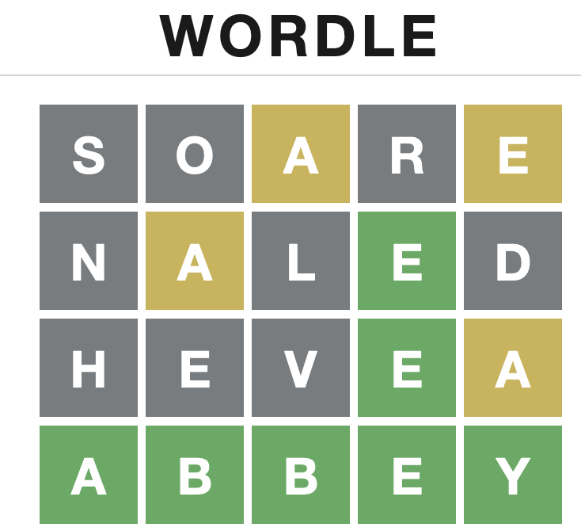

# Solver for wordle



This is a solver for [wordle](https://www.powerlanguage.co.uk/wordle/)
using a very basic heuristic.  The initial word is chosen as the word
that contains the most frequent letters, and for every response by the
game, the words remaining that fit the reponse are ranked by overlap
with the letter frequency.  In my testing I consistently get around
3-4 attempts.  I've done a more rigorous analysis of the solver and it
takes 3.891 attempts on average to solve the game.  The best solvers
get 3.41 attempts using information-theoretic methods.

```haskell
eval = do 
  s <- lines <$> readFile "solutions.txt"
  let l = map (length . play' s "aorta") s
  print $ fromIntegral (sum l) / fromIntegral (length l)
```

## Usage
Input the response given by the game.  `W` for a wrong letter (gray),
`I` for an included letter (yellow), `E` for an exact match (green).

```ShellSession
$ runhaskell solver.hs
Use the guess returned by the solver and input 5 letters {W,E,I}.
W = Wrong, E = Exact, I = Included
2315 solutions left
Guess: aorta
Enter response: IWWWW
243 solutions left
Guess: scale
Enter response: IWIWE
2 solutions left
Guess: pause
Enter response: EEEEE
Solution: pause
```
