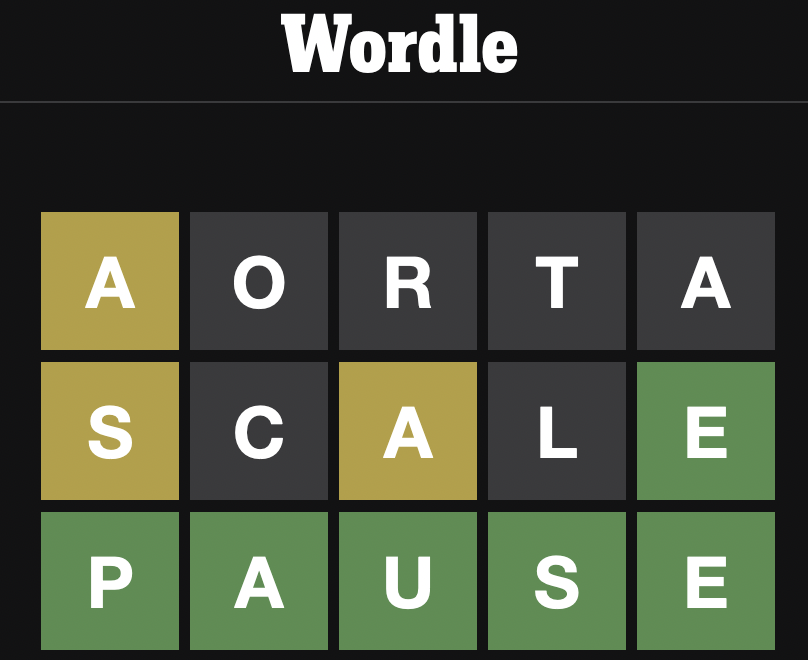

# Solver for wordle



This is a solver for [wordle](https://www.powerlanguage.co.uk/wordle/)
using a very basic heuristic.  The initial word is chosen as the word
that contains the most frequent letters, and for every response by the
game, the words remaining that fit the reponse are ranked by overlap
with the letter frequency.  In my testing I consistently get around 4
attempts.

## Usage
Input the response given by the game.  `W` for wrong letter (gray),
`I` for inclusion (yellow), `E` for exact (green).

```
$ runhaskell solver.hs 
12972 candidates left
Guess: soare
Enter response: WWIWI
349 candidates left
Guess: naled
Enter response: WIWEW
3 candidates left
Guess: hevea
Enter response: WWWEI
Solution: abbey
```
